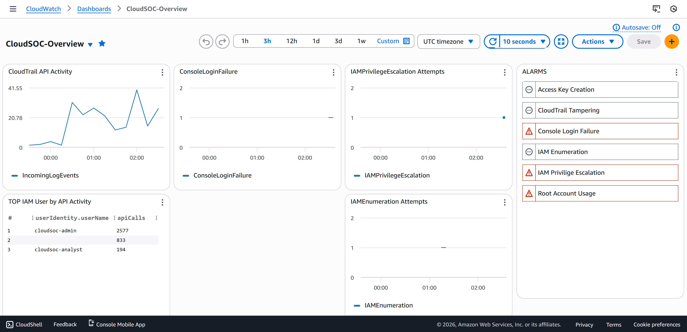

# Cloud SOC Detection & Response Lab (AWS)
This project implements a cloud-native Security Operations Center (SOC) detection and alerting pipeline on AWS. It focuses on identifying identity-based attacks using CloudTrail telemetry, CloudWatch metric filters, and SOC-tuned alarms mapped to the MITRE ATT&CK framework. All detections were validated through simulated attacker behavior.

 ## Threat Model
 This lab models a cloud environment where an attacker is either attempting to breach an account, or has obtained low-privilege credentials. the primary objective is to detect identity-based attack behaviors, including recoinnassance, privilege escalation, persistence, and defense evasion.

 ## Architecture Overview

 CloudTrail is configured using a multi-region trail and forwards management to both S3 buckets and CloudWatch logs. Metric Filters extract security signal events, which are evaluated by CloudWatch alarms. a centralized SOC dashboard provides centralized real time visibility into alers and activity.

 IAM users are created using the least privilege principle, this allows for the simulation and validation of attacker behavior.

 ## Architecture Diagram 
 

 ## Implemented Detections

| Detection | Description | Severity |
|---------|------------|----------|
| IAM Privilege Escalation | Detects denied attempts to attach admin-level IAM policies | High |
| Console Login Abuse | Detects bursts of failed AWS console logins | Medium |
| Root Account Usage | Detects any root user activity | Critical |
| IAM Enumeration | Detects burst IAM discovery API calls | Medium–High |
| Access Key Creation | Detects creation of new IAM access keys | High |
| CloudTrail Tampering | Detects attempts to stop or delete logging | Critical |

## SOC Dashboard

A centralized CloudWatch dashboard provides visibility into:
- Active security alarms
- Privilege escalation attempts
- Console login failures
- IAM users by API activity

The dashboard enables rapid triage and situational awareness for SOC analysts.

## SOC Dashboard Picture

## Incident Response Playbooks

Each detection includes a SOC-style playbook outlining:
- Triage steps
- Investigation queries
- False-positive analysis
- Containment actions

Example playbooks:
- [IAM Privilege Playbook](Playbooks/iam-privilege-escalation-attempt-playbook.md)
- [Root Usage Playbook](Playbooks/root-usage-playbook.md)

## Future Improvements

- Add automated response via Lambda for high-confidence alerts
- Correlate IAM activity with source IP reputation
- Integrate GuardDuty findings
- Expand detections to network and workload-based threats
